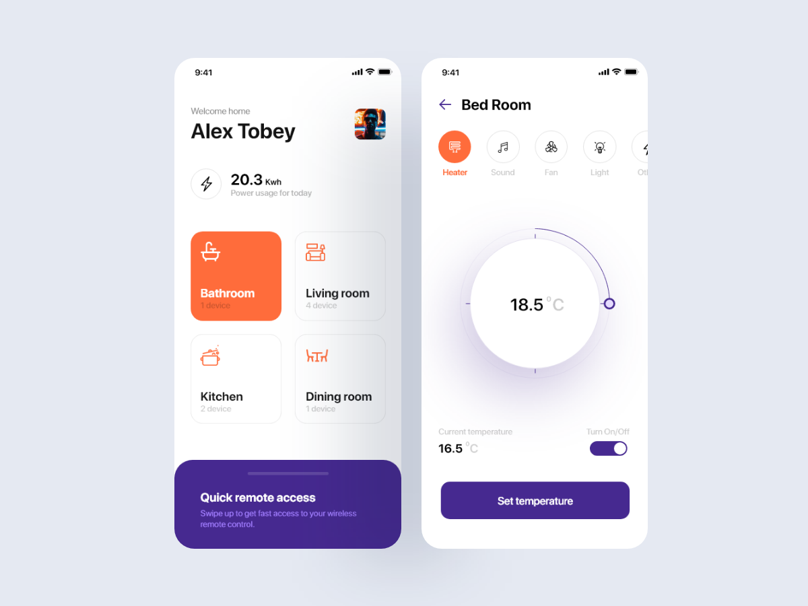

# smart_home_design_Flutter

Putting into practice the creation of a more elaborate layout.

Application aimed at controlling smart homes.

 
<a href="https://www.uplabs.com/adarshg">Designed by Adarsh Goldar</a>

## Getting Started

This project is a starting point for a Flutter application.

A few resources to get you started if this is your first Flutter project:

- [Lab: Write your first Flutter app](https://flutter.dev/docs/get-started/codelab)
- [Cookbook: Useful Flutter samples](https://flutter.dev/docs/cookbook)

For help getting started with Flutter, view our
[online documentation](https://flutter.dev/docs), which offers tutorials,
samples, guidance on mobile development, and a full API reference.
